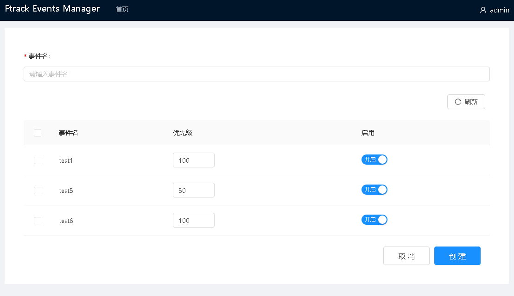
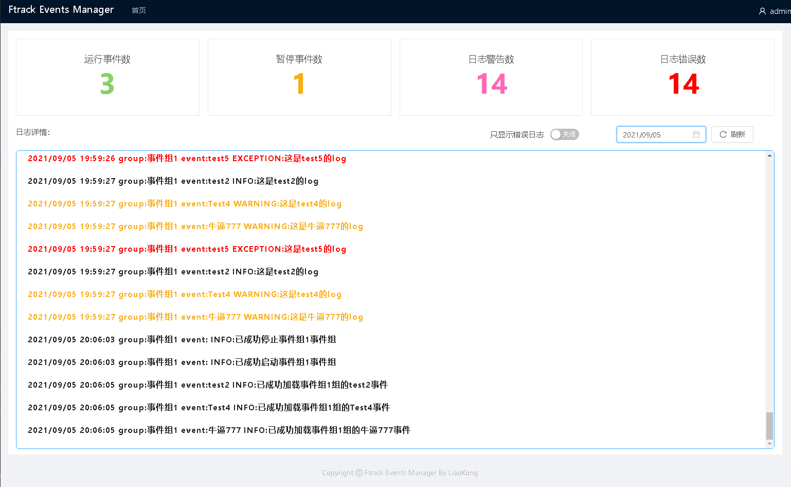

# 登录
该程序只做了简单的账号密码验证，如需修改请修改```ftrack_events_manager_server.api.user```
:::tip
账号：admin 密码：123456
:::

# 添加事件组
进入首页后，只需要点击右上角添加事件按钮即可进入 添加事件 页面。


然后设置事件名称，以及选择下面需要添加到组中的事件并且点击创建即可。

当然，同时也可以设置事件是否启用和事件对应的优先级。
:::tip
在事件选择框中显示的事件都是未被添加到组中的事件。

事件默认优先级为在注册装饰器中设置的值（默认为100）
:::

## 说明
事件优先级: 值越小，先会被执行。

是否启用: 这个功能主要是用于，如果需要单独本地调试一个事件，服务器不想启动这个事件，只需要在组里面直接将该事件禁用即可。

# 事件详情
只需要点击页面中事件对应的```详情按钮```即可进入详情页面。

该页面展示了该事件组详细信息以及该事件组所产生的日志信息。

在右上角可以切换其他日期的日志。

# 事件组操作
在主页可以方便的对事件组进行```启动```/```暂停```/```编辑```/```删除```的操作。
